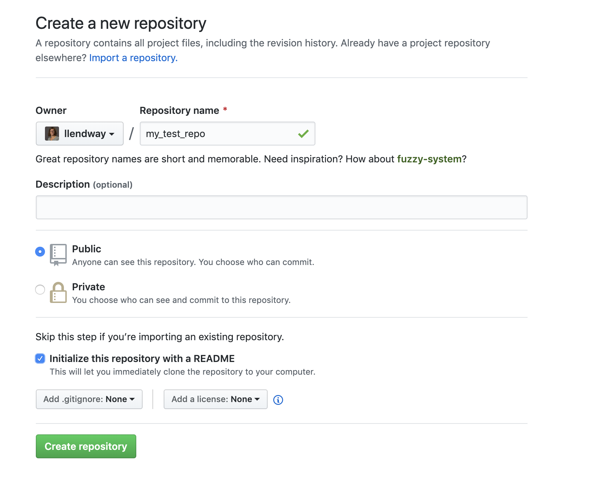

# Git and GitHub

Git is a version control system. It's like Google docs, but accommodates many types of files that Google docs cannot ... like .rmd files! GitHub is an online interface to work with Git. 

Why are we learning these things?!

1. GitHub is well integrated with RStudio. So, we won't need to use any command-line functions, at least not after we have everything set up.

2. You are required to use R for your final project. The presentation or paper needs to be written up as a .rmd document that can be knitted to an html document. Using GitHub will allow you to easily work with your group even when you are not together.

3. GitHub teaches you good habits. You are forced to think about when you save and to make notes about what changes you made each time you do, for example.


# Create a GitHub account

* Go to http://github.com
* Create a username ... see Jenny Bryan's [tips](https://happygitwithr.com/github-acct.html). Incorporate your actual name, use another user name you already have, *pick a username you will be comfortable revealing to a future boss*. Your Macalester username might be a good option. 

# Install Git

* Check to see if you already have Git installed. This will only be the case if you have used it somewhere else. To do this, either open the shell or, in R Studio, expand the Console. There should be a tab that says Terminal. In that area type

```
which git
```

If this returns something like

```
/usr/bin/git
```

then you are finished and don't need to install Git.

* If you do not have Git installed, you need to install it. The instructions are slightly different for Windows and Macs.

* On a Windows machine:

  + Install [Git for Windows](https://gitforwindows.org/). When asked about “Adjusting your PATH environment”, make sure to select “Git from the command line and also from 3rd-party software”. Otherwise, we believe it is good to accept the defaults. 
  + RStudio for Windows prefers for Git to be installed below C:/Program Files and this appears to be the default. This implies, for example, that the Git executable on my Windows system is found at C:/Program Files/Git/bin/git.exe. Unless you have specific reasons to otherwise, follow this convention.
  
* On a Mac:

  + Go to the shell/terminal and enter one of these commands to elicit an offer to install developer command line tools. Accept the offer ... click on install.
  
```
git --version
git config
```

* Install the `usethis` package in R Studio. Then, close R Studio and reopen it. 

* Load the `usethis` library: 

```
library(usethis)
```

* Run the following code with some minor changes. The `user.name` is your Git username. This can be different from your GitHub username, although it might be a good idea to just keep it the same. The `user.email` *MUST* be the same as your GitHub user email. 


# Create your first repo and use it with R Studio

The word "repo" is short for repository, and that is exactly what it is: a place for things (our files, in this case) to be stored. It is like the folder you created to store all your work for this class. 

Let's go to [GitHub](https://github.com/) and login. After you login, you should see a little icon in the upper right-hand corner. Mine is an image of me. If I click on that a drop-down appears and I can choose "Your repositories". Do that. You should see something like this:


Click on the "New" button. Name your repository `my_test_repo` and click "Initialize this repository with a README". Then click Create repository.



There are things you can do directly within GitHub, but we'll focus on its integration with R Studio. 

# Cloning a repo

Think of cloning a repo as "copying" the repository to your computer. But when it does the copying, it keeps the connection with the online repo. 

Let's do this. On your my_test_repo page, choose the green button that says Clone or download. Copy the path by highlighting and clicking the icon that looks like a notebook with an arrow on it. 

Now go to R Studio. Click on File --> New Project ... You should see a window that looks like this:


Choose Version Control. Then you should see a screen that looks like this:


Choose Git. Then you should see a screen that looks like this one, without all the details filled in. The Repository URL is where you should paste the repo URL you cloned from github. It will also populate the Project directory name. Just leave that. **Pay attention** to where the project directory is located and change it to a better directory if appropriate. Click Create Project. 


If you look in the Files tab in the lower right-hand pane of R Studio, you should see the .gitignore file, the project file (ends in .Rproj), and the README.md file. You should also see a Git tab in the upper right-hand pane in R Studio. If you click on the Git tab right now, you won't see anything there.  

With the Git tab open, let's open the README.md file in R Studio. Make a small change to the file by adding the sentence, "I am changing something in this file." Then, click the save icon. When you do this, you will see README.md show up in the Git tab. 

Now, click the Commit button in the Git tab. Click the box next to the README.md file, **add a comment to the commit box**, and click commit. It will give you a message saying it is complete. 

The change you made has now been committed (pun intended!) to local memory. The changed file is only change on your computer, NOT online if you look at GitHub ... go check. Click the Diff button in the Git tab and you can see the history of your commits. 

Next, we are going to push those changes to GitHub by clicking the green up arrow in the Git tab. This will give you a message

# Adding collaborators

# Commit --> Push --> Pull --> ... (and Communication)

# Merge conflicts

# Let's try this!

# Resources

[Happy git with R by Jenny Bryan](https://happygitwithr.com/): great resource although it references the command line quite a bit


